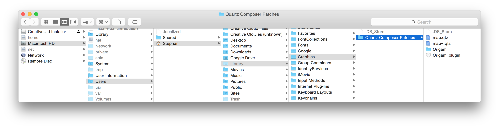

# Ease between states in [Quartz Composer](http://en.wikipedia.org/wiki/Quartz_Composer)

## Description
Let's you ease between multiple states. Great for prototyping application onboardings where the user can swipe though muliple pages manually.

## Installation

Drop the patch into `Users ▶ {You} ▶ Library ▶ Graphics ▶ Quartz Composer Patches`

Note that the folder Library is hidden but [you can make it visible](http://ianlunn.co.uk/articles/quickly-showhide-hidden-files-mac-os-x-mavericks/).

The example uses patches from Facebook's [Origami](http://facebook.github.io/origami/), which I encourage you to install instantly, because it is the best thing that happened to Quartz Composer for interface prototyping.

## Usage
One value defines what a frame is. In the example it is how far a layer has been scrolled.  The patch then eases between the selected keyframe values.

See example for detailed usage or contact me (hello@stephanbogner.de) if you have questions.

## Known limitations
Supports only five states for now.

## License
Public Domain

## More
- Colors taken from the great game [Monument Valley](http://www.monumentvalleygame.com/)
- Gif created with [GifRocket](http://www.gifrocket.com/)